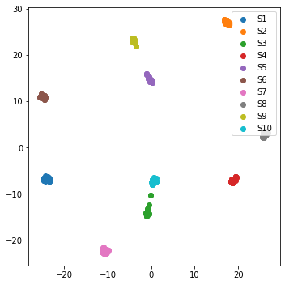

## This is a complete implementation of 'Generalized End-to-End loss for speaker verification (GE2E Loss)'


### Paper used (implemeneted) in this repo
- [Generalized End-to-End Loss for Speaker Verification](https://arxiv.org/abs/1710.10467)
- **Please note**: 
  - Data used here is very elementary.
  - 10 speakers from ```librispeech_test-other``` and 4 additional speakers. Total 14 speakers.
- Please prepare you own data to train the model for your usecase.
  - Since the model is trained on 14 people's voice, it can only identify those 14 people.
  - If you wish, you could collect sample voices for 'N' different people and retrain the model to be able to identify those 'N' voices. 


### Details and usage
- For a given utterance (audio) of a speaker, this model produces a vector of length 256 (1x256).
- Therefore, a batch of inference might look something like below
- ```tensor([[-0.0024,  0.0119,  0.0133,  ..., -0.1340,  0.0377,  0.1262],
        [-0.0205,  0.0271,  0.0419,  ..., -0.1035,  0.0387,  0.0905],
        [-0.0078,  0.0203,  0.0275,  ..., -0.0943,  0.0301,  0.0814],
        ...,
        [ 0.0220,  0.0717, -0.0553,  ...,  0.1109, -0.1149,  0.0084],
        [ 0.0164,  0.0770, -0.0502,  ...,  0.1053, -0.1108,  0.0152],
        [ 0.0287,  0.0664, -0.0607,  ...,  0.1179, -0.1123,  0.0064]],
       grad_fn=<DivBackward0>)
  
  embeddings.shape -> torch.Size([32, 256])

- The output produced by this model can be used to
  - Voice detection
  - Identify different speakers
  - Voice cloning
  - High fidelity voice generation
  - etc.

### Dependencies
- Python 3
- Numpy
- PyTorch
- librosa


### Pre-trained model

| Embedding Model (GE2E)  |
|----------------|
| [Pre-trained embedding model](https://github.com/gkv856/end2end_auto_voice_conversion/tree/master/static/model_chk_pts/ge2e)| [link](#) | [link](#) |


### Steps to train and use the embdding model**

- Gather audio data -> different utterances from different people.
- Create spectrogram of those audios.
- Train the Speaker Embedding model. 
- Use the code from ```step1_train_embedding_model.py```

  - **Results Step 1 (Embedding model using GE2E loss)**
    - With 4 Speakers
    - With 6 Speakers
    - With 10 Speakers


  

  

  


### Inspired from following github repo (BIG THANKS)
- [AutoVC](https://github.com/auspicious3000/autovc)
- [Resemblyzer](https://github.com/resemble-ai/Resemblyzer)


### License

